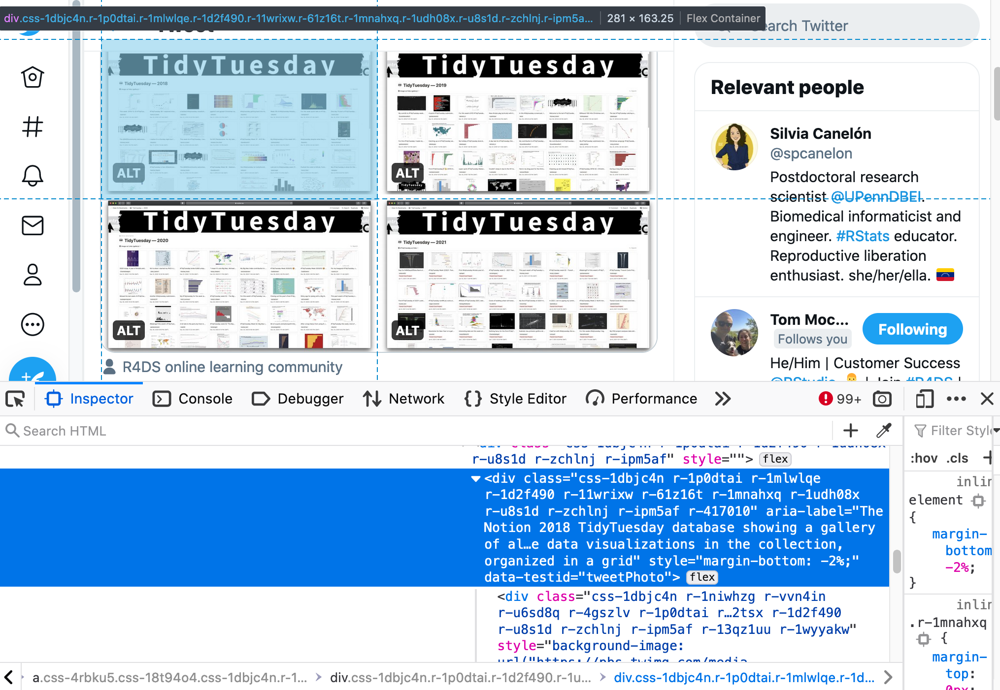

<!-- README.md is generated from README.Rmd. Please edit that file -->

# TidyTuesdayAltText <a href='https://github.com/spcanelon/TidyTuesdayAltText'></a>

<!-- badges: start -->
<!-- badges: end -->

The goal of `TidyTuesdayAltText` is to provide insight into the
alternative (alt) text accompanying the data visualizations shared on
Twitter as part of the TidyTuesday social project[1].

## Navigation

-   [Installation](#installation)
-   [About the data](#about-the-data)
    -   [AltTextSubset](#AltTextSubset)
    -   [ttTweets2021](#ttTweets2021)
    -   [ttTweets2020](#ttTweets2020)
    -   [ttTweets2019](#ttTweets2019)
    -   [ttTweets2018](#ttTweets2018)
-   [Examples](#examples)
-   [License](#license)
-   [Citation](#citation)
-   [References](#references)
-   [Additional resources](#additional-resources)

## Installation

<!--
You can install the released version of TidyTuesdayAltText from [CRAN](https://CRAN.R-project.org) with:
``` r
install.packages("TidyTuesdayAltText")
```
-->

You can install the development version of `TidyTuesdayAltText` from
[GitHub](https://github.com/) with:

``` r
# install.packages("devtools")
devtools::install_github("spcanelon/TidyTuesdayAltText")
```

## About the data

The package contains 5 datasets:

``` r
library(TidyTuesdayAltText)
?ttTweets2018
?ttTweets2019
?ttTweets2020
?ttTweets2021
?AltTextSubset
```

Original data were collected and made available by Tom Mock
([@thomas\_mock](https://twitter.com/thomas_mock)) using
[{rtweet}](https://github.com/ropensci/rtweet).

Tweets were processed and scraped for alternative text by Silvia Canelón
([@spcanelon](https://twitter.com/spcanelon))

1.  Data were filtered to remove tweets without attached media
    (e.g. images)
2.  Data were supplemented with reply tweets collected using {rtweet}.
    This was done to identify whether the original tweet or a reply
    tweet contained an external link (e.g. data source, repository with
    source code)
3.  Alternative (alt) text was scraped from tweet images using
    [{RSelenium}](https://docs.ropensci.org/RSelenium/). The first image
    attached to each tweet was considered the primary image and only the
    primary image from each tweet was scraped for alternative text. The
    following attributes were used to build the scraper:

-   CSS selector: `.css-1dbjc4n.r-1p0dtai.r-1mlwlqe.r-1d2f490.r-11wrixw`
-   Element attribute: `aria-label`

<div class="figure" style="text-align: center">


<p class="caption">
Example of web inspection being used to identify the CSS selector
utilized for alt-text web scraping
</p>

</div>

This data package does not include data that could directly identify the
tweet author in order to respect any author’s decision to delete a tweet
or make their account private after the data was originally
collected.[2]

To obtain the tweet text, author screen name, and many other tweet
attributes, you can “rehydrate” the `TweetId`s (or “status” ids[3])
using the {rtweet} package.[4]

### AltTextSubset

A dataset containing the alternative text for media shared between 2018
and 2021 as part of the TidyTuesday social project, and other attributes
of 441 tweets. This is a subset of the 2018-2021 datasets, containing
only tweets with alternative text that isn’t “Image,” the default
alternative text added by the Twitter app in the absence of customized
alternative text. More information can be found using `?AltTextSubset`.

-   Dates included: April 10, 2018 to April 4, 2021.
-   Observations (rows): There are 465 rows in this dataset. Each row
    represents a single unique tweet post.
-   Variables (columns): There are 7 columns in this dataset. They are
    described below

| variable    | data\_type | description                                                                 |
|:------------|:-----------|:----------------------------------------------------------------------------|
| TweetId     | character  | &lt;chr&gt; Unique tweet identifier                                         |
| ImageUrl    | character  | &lt;chr&gt; URL to the media shared in the tweet                            |
| AltText     | character  | &lt;chr&gt; Alternative text corresponding to the media shared in the tweet |
| HashtagList | list       | &lt;list&gt; List of hashtags used in the tweet                             |
| TweetDate   | double     | &lt;dttm&gt; Date and time the tweet was posted                             |
| Year        | integer    | &lt;fct&gt; Year the tweet was posted                                       |
| UrlCheck    | integer    | &lt;fct&gt; Denotes whether the tweet included an external link             |

### ttTweets2021

Link to the raw data:
[data-raw/ttTweets2021.csv](data-raw/ttTweets2021.csv)

A dataset containing the alternative text for media shared in 2021 as
part of the TidyTuesday social project, and other attributes. More
information can be found using `?ttTweets2021`.

-   Dates included: January 1, 2021 to April 4, 2021.
-   Observations (rows): There are 1032 rows in this dataset. Each row
    represents a single unique tweet post.
-   Variables (columns): There are 7 columns in this dataset. They are
    described below

| variable    | data\_type | description                                                                 |
|:------------|:-----------|:----------------------------------------------------------------------------|
| TweetId     | character  | &lt;chr&gt; Unique tweet identifier                                         |
| ImageUrl    | character  | &lt;chr&gt; URL to the media shared in the tweet                            |
| AltText     | character  | &lt;chr&gt; Alternative text corresponding to the media shared in the tweet |
| HashtagList | list       | &lt;list&gt; List of hashtags used in the tweet                             |
| TweetDate   | double     | &lt;dttm&gt; Date and time the tweet was posted                             |
| Year        | integer    | &lt;fct&gt; Year the tweet was posted                                       |
| UrlCheck    | integer    | &lt;fct&gt; Denotes whether the tweet included an external link             |

### ttTweets2020

Link to the raw data:
[data-raw/ttTweets2020.csv](data-raw/ttTweets2020.csv)

A dataset containing the alternative text for media shared in 2021 as
part of the TidyTuesday social project, and other attributes. More
information can be found using `?ttTweets2020`.

-   Dates included: January 1, 2020 to December 31, 2020
-   Observations (rows): There are 3374 rows in this dataset. Each row
    represents a single unique tweet post.
-   Variables (columns): There are 7 columns in this dataset. They are
    described below

| variable    | data\_type | description                                                                 |
|:------------|:-----------|:----------------------------------------------------------------------------|
| TweetId     | character  | &lt;chr&gt; Unique tweet identifier                                         |
| ImageUrl    | character  | &lt;chr&gt; URL to the media shared in the tweet                            |
| AltText     | character  | &lt;chr&gt; Alternative text corresponding to the media shared in the tweet |
| HashtagList | list       | &lt;list&gt; List of hashtags used in the tweet                             |
| TweetDate   | double     | &lt;dttm&gt; Date and time the tweet was posted                             |
| Year        | integer    | &lt;fct&gt; Year the tweet was posted                                       |
| UrlCheck    | integer    | &lt;fct&gt; Denotes whether the tweet included an external link             |

### ttTweets2019

Link to the raw data:
[data-raw/ttTweets2019.csv](data-raw/ttTweets2019.csv)

A dataset containing the alternative text for media shared in 2021 as
part of the TidyTuesday social project, and other attributes. More
information can be found using `?ttTweets2019`.

-   Dates included: January 1, 2019 to December 31, 2019.
-   Observations (rows): There are 2022 rows in this dataset. Each row
    represents a single unique tweet post.
-   Variables (columns): There are 7 columns in this dataset. They are
    described below

| variable    | data\_type | description                                                                 |
|:------------|:-----------|:----------------------------------------------------------------------------|
| TweetId     | character  | &lt;chr&gt; Unique tweet identifier                                         |
| ImageUrl    | character  | &lt;chr&gt; URL to the media shared in the tweet                            |
| AltText     | character  | &lt;chr&gt; Alternative text corresponding to the media shared in the tweet |
| HashtagList | list       | &lt;list&gt; List of hashtags used in the tweet                             |
| TweetDate   | double     | &lt;dttm&gt; Date and time the tweet was posted                             |
| Year        | integer    | &lt;fct&gt; Year the tweet was posted                                       |
| UrlCheck    | integer    | &lt;fct&gt; Denotes whether the tweet included an external link             |

### ttTweets2018

Link to the raw data:
[data-raw/ttTweets2018.csv](data-raw/ttTweets2018.csv)

A dataset containing the alternative text for media shared in 2021 as
part of the TidyTuesday social project, and other attributes. More
information can be found using `?ttTweets2018`.

-   Dates included: April 2, 2018 to December 31, 2018.
-   Observations (rows): There are 709 rows in this dataset. Each row
    represents a single unique tweet post.
-   Variables (columns): There are 7 columns in this dataset. They are
    described below

| variable    | data\_type | description                                                                 |
|:------------|:-----------|:----------------------------------------------------------------------------|
| TweetId     | character  | &lt;chr&gt; Unique tweet identifier                                         |
| ImageUrl    | character  | &lt;chr&gt; URL to the media shared in the tweet                            |
| AltText     | character  | &lt;chr&gt; Alternative text corresponding to the media shared in the tweet |
| HashtagList | list       | &lt;list&gt; List of hashtags used in the tweet                             |
| TweetDate   | double     | &lt;dttm&gt; Date and time the tweet was posted                             |
| Year        | integer    | &lt;fct&gt; Year the tweet was posted                                       |
| UrlCheck    | integer    | &lt;fct&gt; Denotes whether the tweet included an external link             |

## Citation

To cite the TidyTuesdayAltText package, please use:

``` r
citation("TidyTuesdayAltText")
#> 
#> To cite TidyTuesdayAltText in publications use:
#> 
#>   Canelón SP, Mock JT, and Hare E (2021). TidyTuesdayAltText:
#>   Alternative text for media attached to TidyTuesday tweets. R package
#>   version 0.0.9. https://github.com/spcanelon/TidyTuesdayAltText. doi:
#>   ???
#> 
#> A BibTeX entry for LaTeX users is
#> 
#>   @Manual{,
#>     title = {TidyTuesdayAltText: Alternative text for media attached to TidyTuesday tweets},
#>     author = {Silvia P. Canelón and Thomas Mock and Elizabeth Hare},
#>     year = {2021},
#>     note = {R package version 0.0.9},
#>     url = {https://github.com/spcanelon/TidyTuesdayAltText},
#>   }
```

## References

Data and hex logo originally published in:

-   Thomas Mock (2021). Tidy Tuesday: A weekly data project aimed at the
    R ecosystem. <https://github.com/rfordatascience/tidytuesday>

Many thanks to Liz Hare
([@DogGeneticsLLC](https://twitter.com/DogGeneticsLLC)) for testing the
package in development and performing the analyses that went into our
[CSV Conf 2021 talk](https://github.com/spcanelon/csvConf2021).

And thank you to the following resources for providing guidance and
inspiration for how this package was organized and documented:

-   [Chapter 12 Create a data package \|
    rstudio4edu](https://rstudio4edu.github.io/rstudio4edu-book/data-pkg.html)
-   The Pudding. Repo:
    [the-pudding/data/foundation-names](https://github.com/the-pudding/data/tree/master/foundation-names)
-   Horst AM, Hill AP, Gorman KB (2020). palmerpenguins: Palmer
    Archipelago (Antarctica) penguin data. R package version 0.1.0.
    <https://allisonhorst.github.io/palmerpenguins/>.
    <doi:10.5281/zenodo.3960218>.

## Additional resources

<!--
## Example
This is a basic example which shows you how to solve a common problem:

```r
library(TidyTuesdayAltText)
## basic example code
```
What is special about using `README.Rmd` instead of just `README.md`? You can include R chunks like so:

```r
summary(cars)
#>      speed           dist       
#>  Min.   : 4.0   Min.   :  2.00  
#>  1st Qu.:12.0   1st Qu.: 26.00  
#>  Median :15.0   Median : 36.00  
#>  Mean   :15.4   Mean   : 42.98  
#>  3rd Qu.:19.0   3rd Qu.: 56.00  
#>  Max.   :25.0   Max.   :120.00
```
You'll still need to render `README.Rmd` regularly, to keep `README.md` up-to-date. `devtools::build_readme()` is handy for this. You could also use GitHub Actions to re-render `README.Rmd` every time you push. An example workflow can be found here: <https://github.com/r-lib/actions/tree/master/examples>.
-->

[1] [rfordatascience/tidytuesday: Official repo for the \#tidytuesday
project](https://github.com/rfordatascience/tidytuesday#a-weekly-social-data-project-in-r)

[2] [Developer Policy – Twitter Developers \| Twitter
Developer](https://developer.twitter.com/en/developer-terms/policy)

[3] [Tweet object \| Twitter
Developer](https://developer.twitter.com/en/docs/twitter-api/data-dictionary/object-model/tweet)

[4] [Get tweets data for given statuses (status IDs). — lookup\_tweets •
rOpenSci:
rtweet](https://docs.ropensci.org/rtweet/reference/lookup_tweets.html)
